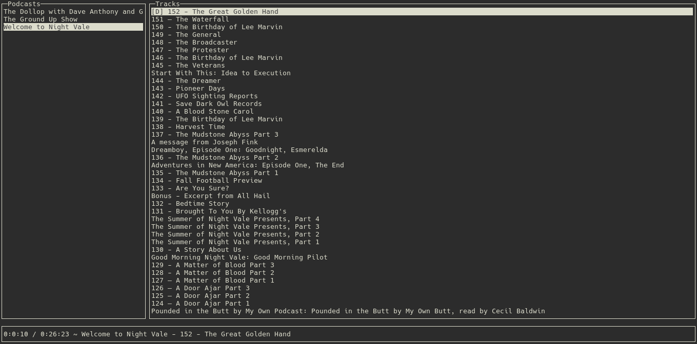

# Podgo

**Podgo** is a terminal based app that allows you to manage and play your favorite podcasts! It uses the great library [Gocui](https://github.com/jroimartin/gocui) with an extra layer called [Songocui](https://github.com/UgoTurner/songocui) and the feed parser library [Gofeed](https://github.com/mmcdole/gofeed).

## Support

Currently only supports Linux platforms.

## Installation

### From source code

    go get github.com/uturner/podgo
	cd $GOPATH/src/github.com/uturner/podgo
	go build
	./podgo

## Usage

### Layout
The terminal is split in 3 different panels :
1. **Podcasts list (side panel)** which contains the list of the user's saved podcasts.
2. **Tracks list (main panel)** which contains the tracks list of a selected podcast.
3. **Summary (footer panel)** which displays the player and the prompt when an action is required.

### Key bindings

Key combination | Description
---|---
<kbd>&uarr; and &darr;</kbd>|Navigate up and down in the list views
<kbd>&rarr;</kbd>|Enter into the next view
<kbd>Ctrl</kbd>+<kbd>a</kbd>|Add new podcast feed (then <kbd>Enter</kbd> to confirm it)
<kbd>Ctrl</kbd>+<kbd>d</kbd>|Download the selected track
<kbd>Ctrl</kbd>+<kbd>p</kbd>|Play (and download if it is not done yet) the selected track
<kbd>Ctrl</kbd>+<kbd>space</kbd>|Toggle play/pause
<kbd>Ctrl</kbd>+<kbd>f</kbd>|Seek forward
<kbd>Ctrl</kbd>+<kbd>b</kbd>|Seek backward
<kbd>Ctrl</kbd>+<kbd>c</kbd>|Exit Podgo
